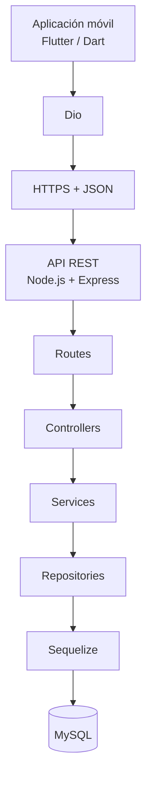
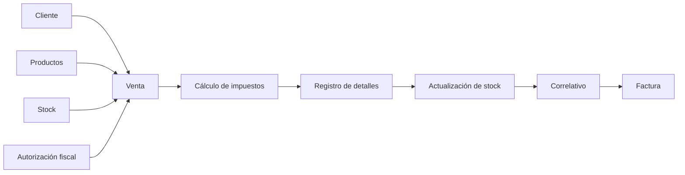
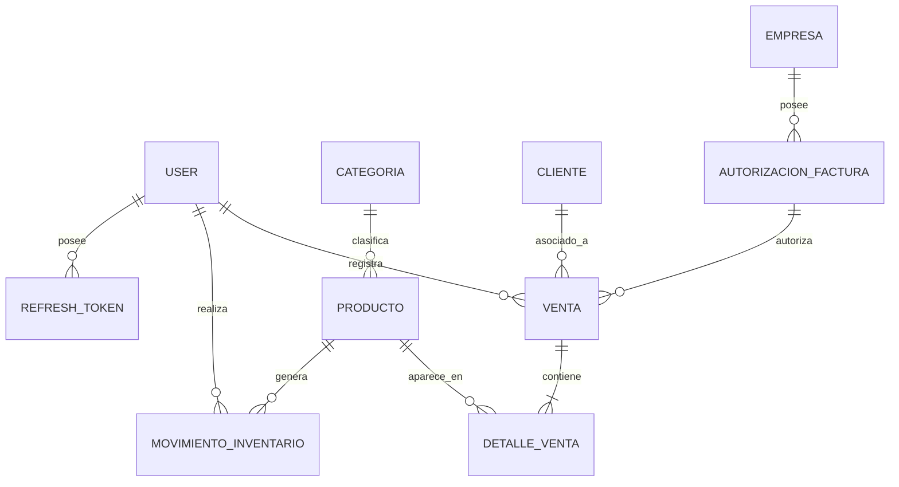

<p align="center">
  
</p>

<h1 align="center">Inventario Fácil</h1>

<p align="center">
  Sistema móvil para la gestión de inventario, clientes, ventas y facturación.
</p>

<p align="center">
  <strong>Flutter · Node.js · Express · Sequelize · MySQL</strong>
</p>

---

## Descripción

**Inventario Fácil** es un proyecto académico desarrollado para centralizar en una sola solución móvil los procesos principales de un negocio: productos, categorías, inventario, clientes, ventas, facturación, configuración fiscal y usuarios.

El sistema está dividido en dos aplicaciones que trabajan de forma conjunta:

- **[Aplicación móvil](https://github.com/ISMAuri/programacion-movil-proyecto):** desarrollada con Flutter y Dart.
- **[Backend / API REST](https://github.com/ISMAuri/backend-inventario-facil):** desarrollado con Node.js, Express, Sequelize y MySQL.

La aplicación móvil nunca accede directamente a la base de datos. Todas las operaciones pasan por la API REST, donde se aplican validaciones, reglas de negocio y persistencia.

El proyecto busca resolver un problema común en pequeños negocios: mantener sincronizados el inventario, las ventas, los clientes y la información de facturación dentro de un mismo proceso, evitando registros dispersos y reduciendo inconsistencias entre las distintas operaciones.

---

## Objetivo general

Desarrollar un sistema móvil que permita administrar inventario y ventas de forma centralizada, manteniendo trazabilidad y control sobre las operaciones del negocio.

### Objetivos específicos

- Administrar productos, categorías y existencias.
- Registrar clientes y mantener su información disponible para facturación.
- Registrar ventas y actualizar automáticamente el inventario.
- Generar facturas con numeración correlativa.
- Gestionar datos fiscales y autorizaciones de facturación.
- Mantener historial de ventas y autorizaciones.
- Diferenciar funcionalidades según el rol del usuario.
- Proteger el acceso mediante autenticación.
- Permitir recuperación y cambio de contraseña.
- Mantener la información histórica de las facturas aunque otros datos del sistema cambien posteriormente.

---

## Estado del proyecto

El sistema se encuentra **funcional** para los objetivos académicos planteados.

Actualmente cuenta con:

- Autenticación de usuarios.
- Perfil de usuario y cambio de contraseña.
- Recuperación de contraseña mediante OTP enviado por correo.
- Gestión de categorías.
- Gestión de productos.
- Control de inventario.
- Gestión de clientes.
- Registro de ventas.
- Historial de ventas.
- Facturación en PDF.
- Manejo de impuestos.
- Manejo de autorización fiscal y CAI.
- Historial de autorizaciones fiscales.
- Anulación de facturas.
- Restauración de stock al anular ventas.
- Roles de administrador y empleado.
- Panel administrativo con AdminJS.
- API desplegada en Railway con HTTPS.

---

## Arquitectura

Inventario Fácil utiliza una arquitectura cliente-servidor.



En el backend se utiliza la siguiente separación:

```text
Route
  ↓
Controller
  ↓
Service
  ↓
Repository
  ↓
Sequelize Model
  ↓
MySQL
```

### Responsabilidad de cada capa

| Capa       | Responsabilidad                                        |
| ---------- | ------------------------------------------------------ |
| Route      | Define endpoints, middleware y validaciones de entrada |
| Controller | Recibe la solicitud HTTP y genera la respuesta         |
| Service    | Contiene reglas y lógica de negocio                    |
| Repository | Centraliza el acceso a datos mediante Sequelize        |
| Model      | Representa las tablas y relaciones de la base de datos |
| MySQL      | Almacena la información persistente del sistema        |

---

## Tecnologías utilizadas

### Aplicación móvil

| Tecnología                  | Uso                                         |
| --------------------------- | ------------------------------------------- |
| Flutter                     | Desarrollo de la aplicación móvil           |
| Dart                        | Lenguaje principal de la aplicación         |
| Dio                         | Consumo de la API REST                      |
| Shared Preferences          | Persistencia local de información de sesión |
| Path Provider               | Manejo de rutas de archivos                 |
| Open Filex                  | Apertura de documentos generados            |
| Flutter Local Notifications | Notificaciones locales                      |
| Material Design             | Componentes visuales                        |

### Backend

| Tecnología         | Uso                                      |
| ------------------ | ---------------------------------------- |
| Node.js            | Entorno de ejecución                     |
| Express.js         | API REST                                 |
| Sequelize          | ORM                                      |
| MySQL              | Base de datos relacional                 |
| express-validator  | Validación de datos de entrada           |
| JWT                | Autenticación                            |
| bcrypt             | Hash de contraseñas                      |
| express-rate-limit | Limitación de solicitudes sensibles      |
| Resend             | Envío de correos de recuperación         |
| Node Crypto        | Operaciones criptográficas del flujo OTP |
| PDFKit             | Generación de facturas PDF               |
| AdminJS            | Panel administrativo                     |
| Railway            | Despliegue del backend                   |

### Comunicación

La aplicación y la API intercambian información mediante:

```text
HTTPS + JSON
```

API de producción:

```text
https://api2.ismaelcastillo.me/api
```

En un emulador Android, para desarrollo local, puede utilizarse:

```text
http://10.0.2.2:4000/api
```

Desde herramientas como Postman en la misma computadora:

```text
http://localhost:4000/api
```

---

## Módulos del sistema

### Autenticación y perfil

El sistema permite:

- Iniciar sesión con correo y contraseña.
- Consultar el perfil del usuario autenticado.
- Actualizar nombre y correo.
- Cambiar la contraseña.
- Cerrar sesión.
- Recuperar el acceso mediante código OTP.

Las contraseñas se almacenan utilizando hash con **bcrypt**.

---

### Recuperación de contraseña

El proceso de recuperación sigue el siguiente flujo:

```text
Correo
  ↓
Código OTP de 6 dígitos
  ↓
Verificación
  ↓
Nueva contraseña
```

El código tiene tiempo de expiración y límite de intentos.

La solicitud del OTP también cuenta con limitación de peticiones para reducir abusos.

Los correos son enviados mediante **Resend**.

---

### Categorías

Permite administrar las categorías utilizadas para organizar los productos.

Entre sus funciones se encuentran:

- Listar categorías.
- Consultar una categoría.
- Crear categorías.
- Editar categorías.
- Activar o desactivar categorías.

---

### Productos

Cada producto puede contener:

- Categoría.
- Nombre.
- Descripción.
- Código.
- Precio de compra.
- Precio de venta.
- Stock actual.
- Unidad de medida.
- Tasa de impuesto.
- Estado.

Las tasas utilizadas actualmente por la aplicación son:

```text
0%
15%
18%
```

Las unidades de medida disponibles incluyen:

```text
Unidad
Libra
Kilogramo
Litro
Paquete
Caja
```

---

### Inventario

El sistema mantiene las existencias asociadas a cada producto.

Además, registra movimientos de inventario con información como:

- Producto.
- Usuario.
- Tipo de movimiento.
- Cantidad.
- Motivo.

Los tipos principales de movimiento son:

```text
entrada
salida
```

Las ventas disminuyen las existencias y la anulación de una factura devuelve al inventario las cantidades correspondientes.

---

### Clientes

El módulo de clientes permite almacenar:

- Nombre.
- RTN.
- Dirección.
- Teléfono.
- Correo.
- Estado.

Los clientes pueden utilizarse posteriormente durante el proceso de venta y facturación.

---

### Empresa

El sistema permite almacenar la información de la empresa utilizada en los procesos de facturación:

- Nombre de la empresa.
- Razón social.
- RTN.
- Dirección.
- Teléfono.
- Correo.
- Logo.

---

### Autorizaciones fiscales

La autorización de factura almacena información como:

- Empresa.
- CAI.
- Establecimiento.
- Punto de emisión.
- Tipo de documento.
- Rango inicial.
- Rango final.
- Siguiente correlativo.
- Fecha de autorización.
- Fecha límite de emisión.
- Estado.

El sistema conserva el historial de autorizaciones fiscales.

Cuando se registra una nueva autorización, la anterior puede conservarse como parte del historial del sistema.

El formato utilizado para el CAI es:

```text
XXXXXX-XXXXXX-XXXXXX-XXXXXX-XXXXXX-XX
```

La base de datos protege además el CAI contra registros duplicados mediante una restricción única.

---

### Ventas

El registro de una venta conecta varios módulos del sistema.



Durante una venta se comprueban, entre otras reglas:

- Existencia del usuario.
- Existencia del cliente cuando corresponde.
- Existencia del producto.
- Estado del producto.
- Cantidad válida.
- Stock disponible.
- Autorización fiscal.
- Rango autorizado.
- Fecha límite de emisión.
- Correlativo disponible.
- Tasa de impuesto.

---

### Métodos de pago

La aplicación utiliza actualmente los siguientes métodos de pago:

```text
Efectivo
Tarjeta
Transferencia
Cheque
```

---

### Facturación

El número de factura utiliza una estructura como:

```text
001-001-01-00000004
```

El correlativo se obtiene de la autorización fiscal activa.

Una vez utilizado un número de factura, este no vuelve a quedar disponible.

El backend también verifica la existencia del número de factura antes de registrar una nueva venta.

---

### Impuestos

Las tasas implementadas son:

```text
0%
15%
18%
```

El cálculo de impuestos se realiza por línea de venta después de aplicar los descuentos correspondientes.

La venta conserva información como:

- Subtotal.
- Descuentos.
- Total tasa 0%.
- Base gravada al 15%.
- Base gravada al 18%.
- ISV 15%.
- ISV 18%.
- Total.
- Total expresado en letras.

---

### Historial y snapshots

Las facturas conservan una copia histórica de información importante al momento en que se realiza la venta.

Esto permite que una factura conserve sus datos originales aunque posteriormente cambien:

- Los productos.
- El código de un producto.
- La información del cliente.
- Los datos de la empresa.
- La autorización fiscal.
- El CAI.
- Los rangos fiscales.

De esta forma, las facturas históricas no dependen completamente del estado actual de las demás tablas.

---

### Anulación de facturas

Una factura anulada **no se elimina**.

La anulación:

1. Cambia el estado de la factura.
2. Conserva el número de factura utilizado.
3. Mantiene la información histórica.
4. Devuelve al inventario las cantidades vendidas.
5. Registra los movimientos correspondientes.

La aplicación limita la anulación a un período de **30 días posteriores a la emisión**.

---

## Usuarios y roles

La aplicación utiliza principalmente dos roles:

```text
admin
user
```

El rol `user` representa al empleado.

| Funcionalidad                         | Administrador | Empleado |
| ------------------------------------- | :-----------: | :------: |
| Ver productos                         |      ✅       |    ✅    |
| Crear y editar productos              |      ✅       |    ❌    |
| Ver categorías                        |      ✅       |    ✅    |
| Crear, editar o desactivar categorías |      ✅       |    ❌    |
| Ver inventario                        |      ✅       |    ✅    |
| Registrar ventas                      |      ✅       |    ✅    |
| Consultar historial de ventas         |      ✅       |    ✅    |
| Anular facturas desde la aplicación   |      ✅       |    ❌    |
| Ver clientes                          |      ✅       |    ✅    |
| Crear y editar clientes               |      ✅       |    ✅    |
| Crear usuarios                        |      ✅       |    ❌    |
| Configurar empresa                    |      ✅       |    ❌    |
| Gestionar CAI                         |      ✅       |    ❌    |
| Consultar historial de CAI            |      ✅       |    ❌    |
| Editar su propio perfil               |      ✅       |    ✅    |
| Cambiar su contraseña                 |      ✅       |    ✅    |

Además de las restricciones de interfaz, varias operaciones administrativas del backend utilizan middleware de autorización para restringir el acceso a usuarios administradores.

---

## Seguridad

El proyecto implementa diferentes mecanismos de seguridad:

- Autenticación mediante JWT.
- Contraseñas almacenadas utilizando bcrypt.
- Middleware de autenticación.
- Middleware de autorización para operaciones administrativas.
- Validaciones mediante express-validator.
- Recuperación de contraseña mediante OTP.
- Identificadores de recuperación.
- Expiración de códigos OTP.
- Límite de intentos.
- Rate limiting.
- Sesiones protegidas en AdminJS.
- Cookies HTTP-only en el panel administrativo.
- HTTPS en producción.
- Variables sensibles almacenadas mediante variables de entorno.

> **Importante:** los secretos y credenciales nunca deben almacenarse directamente dentro del repositorio.

---

## Panel administrativo

El backend incluye un panel construido con **AdminJS**.

Ruta base:

```text
/admin
```

El panel utiliza autenticación de administrador y permite consultar diferentes recursos del sistema:

- Categorías.
- Productos.
- Movimientos de inventario.
- Clientes.
- Ventas.
- Detalles de venta.
- Empresa.
- Autorizaciones fiscales.
- Usuarios.

También incluye un dashboard con información general del negocio.

---

## Modelo de datos

Las principales relaciones del sistema pueden representarse de la siguiente manera:



### Entidades principales

| Entidad                  | Finalidad                             |
| ------------------------ | ------------------------------------- |
| Usuario                  | Autenticación y operación del sistema |
| RefreshToken             | Gestión de sesiones                   |
| Categoría                | Clasificación de productos            |
| Producto                 | Información comercial y stock         |
| Cliente                  | Información del comprador             |
| Empresa                  | Datos del negocio                     |
| Autorización de factura  | CAI, rangos, fechas y correlativos    |
| Venta                    | Encabezado e información fiscal       |
| Detalle de venta         | Productos y cantidades de cada venta  |
| Movimiento de inventario | Historial de entradas y salidas       |

El diagrama entidad-relación completo se encuentra en:

```text
docs/diagrama_er.pdf
docs/diagrama_er.png
docs/diagrama_er.mwb
```

---

## API REST

Todas las rutas principales de negocio se encuentran bajo:

```text
/api
```

### Autenticación

| Método | Endpoint                        | Descripción            |
| ------ | ------------------------------- | ---------------------- |
| POST   | `/api/auth/register`            | Registrar usuario      |
| POST   | `/api/auth/login`               | Iniciar sesión         |
| POST   | `/api/auth/refresh`             | Renovar sesión         |
| POST   | `/api/auth/logout`              | Cerrar sesión          |
| GET    | `/api/auth/me`                  | Obtener perfil         |
| PUT    | `/api/auth/me`                  | Actualizar perfil      |
| PUT    | `/api/auth/me/password`         | Cambiar contraseña     |
| POST   | `/api/auth/password/otp`        | Solicitar OTP          |
| POST   | `/api/auth/password/otp/verify` | Verificar OTP          |
| PUT    | `/api/auth/password/reset`      | Restablecer contraseña |
| GET    | `/api/auth/:id`                 | Consultar usuario      |

### Categorías

| Método | Endpoint              | Descripción                     |
| ------ | --------------------- | ------------------------------- |
| GET    | `/api/categorias`     | Listar categorías               |
| GET    | `/api/categorias/:id` | Consultar categoría             |
| POST   | `/api/categorias`     | Crear categoría                 |
| PUT    | `/api/categorias/:id` | Actualizar categoría            |
| DELETE | `/api/categorias/:id` | Eliminar o desactivar categoría |

### Productos

| Método | Endpoint             | Descripción                    |
| ------ | -------------------- | ------------------------------ |
| GET    | `/api/productos`     | Listar productos               |
| GET    | `/api/productos/:id` | Consultar producto             |
| POST   | `/api/productos`     | Crear producto                 |
| PUT    | `/api/productos/:id` | Actualizar producto            |
| DELETE | `/api/productos/:id` | Eliminar o desactivar producto |

### Clientes

| Método | Endpoint            | Descripción                   |
| ------ | ------------------- | ----------------------------- |
| GET    | `/api/clientes`     | Listar clientes               |
| GET    | `/api/clientes/:id` | Consultar cliente             |
| POST   | `/api/clientes`     | Crear cliente                 |
| PUT    | `/api/clientes/:id` | Actualizar cliente            |
| DELETE | `/api/clientes/:id` | Eliminar o desactivar cliente |

### Empresa

| Método | Endpoint            | Descripción        |
| ------ | ------------------- | ------------------ |
| GET    | `/api/empresas`     | Listar empresas    |
| GET    | `/api/empresas/:id` | Consultar empresa  |
| POST   | `/api/empresas`     | Crear empresa      |
| PUT    | `/api/empresas/:id` | Actualizar empresa |

### Autorizaciones fiscales

| Método | Endpoint                                                | Descripción                                |
| ------ | ------------------------------------------------------- | ------------------------------------------ |
| GET    | `/api/autorizacion-facturas`                            | Listar autorizaciones                      |
| GET    | `/api/autorizacion-facturas/:id`                        | Consultar autorización                     |
| GET    | `/api/autorizacion-facturas/empresa/:id_empresa/activa` | Obtener autorización activa de una empresa |
| POST   | `/api/autorizacion-facturas`                            | Crear autorización                         |
| PUT    | `/api/autorizacion-facturas/:id`                        | Actualizar autorización                    |
| DELETE | `/api/autorizacion-facturas/:id`                        | Eliminar o desactivar autorización         |

### Ventas

| Método | Endpoint                             | Descripción                  |
| ------ | ------------------------------------ | ---------------------------- |
| GET    | `/api/ventas`                        | Listar ventas                |
| GET    | `/api/ventas/:id`                    | Consultar venta              |
| GET    | `/api/ventas/numero/:numero_factura` | Buscar por número de factura |
| POST   | `/api/ventas`                        | Emitir venta/factura         |
| PUT    | `/api/ventas/:id/anular`             | Anular factura               |
| GET    | `/api/ventas/:id/pdf`                | Descargar factura PDF        |
| PATCH  | `/api/ventas/:id/pdf`                | Actualizar ruta del PDF      |

### Detalles de venta

| Método | Endpoint                                    | Descripción                  |
| ------ | ------------------------------------------- | ---------------------------- |
| GET    | `/api/detalle-ventas/:id`                   | Consultar detalle            |
| GET    | `/api/detalle-ventas/venta/:id_venta`       | Listar detalles por venta    |
| GET    | `/api/detalle-ventas/producto/:id_producto` | Listar detalles por producto |

### Movimientos de inventario

| Método | Endpoint                                            | Descripción                        |
| ------ | --------------------------------------------------- | ---------------------------------- |
| GET    | `/api/movimientos-inventario`                       | Listar movimientos                 |
| GET    | `/api/movimientos-inventario/:id`                   | Consultar movimiento               |
| GET    | `/api/movimientos-inventario/producto/:id_producto` | Consultar movimientos por producto |
| POST   | `/api/movimientos-inventario`                       | Registrar movimiento               |

La colección completa de la API se encuentra en:

```text
docs/Inventario_Facil.postman_collection.json
```

---

## Respuestas y errores de la API

Las validaciones de entrada pueden producir una respuesta similar a:

```json
{
  "message": "Datos de entrada inválidos",
  "errors": [
    {
      "field": "campo",
      "message": "Descripción del error"
    }
  ]
}
```

Entre los códigos HTTP utilizados se encuentran:

| Código | Significado                                   |
| ------ | --------------------------------------------- |
| 200    | Solicitud correcta                            |
| 201    | Recurso creado                                |
| 400    | Datos inválidos o regla de negocio incumplida |
| 401    | Usuario no autenticado                        |
| 403    | Operación no autorizada                       |
| 404    | Recurso no encontrado                         |
| 409    | Conflicto                                     |
| 500    | Error interno del servidor                    |

---

## Reglas de negocio importantes

1. No se permite vender una cantidad superior al stock disponible.
2. Una venta válida reduce las existencias de los productos.
3. Una factura anulada no se elimina.
4. La anulación devuelve al inventario las cantidades correspondientes.
5. El número de una factura anulada continúa consumido.
6. Los correlativos de factura no deben reutilizarse.
7. La autorización fiscal debe estar activa y dentro del rango autorizado.
8. El correlativo debe encontrarse dentro del rango correspondiente.
9. El CAI no debe duplicarse.
10. Las facturas conservan snapshots de información relevante.
11. Las autorizaciones fiscales anteriores se conservan como historial.
12. Las operaciones de venta que modifican múltiples registros utilizan transacciones para mantener consistencia.

---

## Documentación del proyecto

La documentación completa del proyecto se mantiene de forma centralizada:

```text
.
├── README.md
├── docs/
│   ├── manual_usuario.pdf
│   ├── diagrama_er.pdf
│   ├── diagrama_er.png
│   ├── diagrama_er.mwb
│   └── Inventario_Facil.postman_collection.json
└── ...
```

| Documento                                       | Descripción                              |
| ----------------------------------------------- | ---------------------------------------- |
| `README.md`                                     | Descripción técnica general del proyecto |
| `docs/manual_usuario.pdf`                       | Manual de uso del sistema                |
| `docs/diagrama_er.pdf`                          | Diagrama entidad-relación                |
| `docs/Inventario_Facil.postman_collection.json` | Colección de API para Postman            |

---

## Repositorios

El proyecto está dividido en dos repositorios:

| Componente               | Repositorio                                                                           |
| ------------------------ | ------------------------------------------------------------------------------------- |
| Aplicación móvil Flutter | [programacion-movil-proyecto](https://github.com/ISMAuri/programacion-movil-proyecto) |
| Backend / API REST       | [backend-inventario-facil](https://github.com/ISMAuri/backend-inventario-facil)       |

---

## Requisitos para desarrollo

### Backend

Para ejecutar el backend localmente se necesita:

- Node.js.
- npm.
- MySQL.
- Una base de datos para el proyecto.
- Variables de entorno correctamente configuradas.

### Aplicación móvil

Para ejecutar la aplicación se necesita:

- Flutter SDK.
- Dart.
- Android Studio o un dispositivo Android.
- Emulador Android o dispositivo físico.
- Acceso a la API.

El proyecto Flutter declara compatibilidad con Dart:

```text
^3.12.2
```

---

## Instalación del backend

### 1. Clonar el repositorio

```bash
git clone https://github.com/ISMAuri/backend-inventario-facil.git
cd backend-inventario-facil
```

### 2. Instalar dependencias

```bash
npm install
```

### 3. Configurar las variables de entorno

Crear un archivo `.env` en la raíz del proyecto tomando como referencia lo siguiente(no compartir el `.env` personal con nadie):

Ejemplo:

```env
NODE_ENV=development
PORT=4000

# --- Base de datos MySQL ---
DB_HOST=localhost
DB_PORT=3306
DB_NAME=nombre_base_datos
DB_USER=usuario_mysql
DB_PASSWORD=contraseña_mysql

# --- Seeders ---
SEED_ADMIN_PASSWORD=CAMBIAR_POR_UNA_CONTRASEÑA_SEGURA
RUN_SEEDERS=false

# --- Panel administrativo ---
ADMIN_SESSION_SECRET=CAMBIAR_POR_UN_SECRETO_SEGURO

# --- Recuperación de contraseña ---
RESEND_API_KEY=TU_API_KEY_DE_RESEND
RESEND_FROM="Inventario Fácil <seguridad@ismaelcastillo.me>"
OTP_SECRET=CAMBIAR_POR_UN_SECRETO_SEGURO

# --- JWT ---
JWT_ACCESS_SECRET=CAMBIAR_POR_UN_SECRETO_SEGURO
JWT_REFRESH_SECRET=CAMBIAR_POR_UN_SECRETO_SEGURO

# --- Frontend / CORS ---
CLIENT_URL=http://localhost:3000
```

Los valores de:

```text
ADMIN_SESSION_SECRET
OTP_SECRET
JWT_ACCESS_SECRET
JWT_REFRESH_SECRET
```

deben ser secretos largos y aleatorios.

Pueden generarse, por ejemplo, con:

```bash
node -e "console.log(require('crypto').randomBytes(64).toString('hex'))"
```

> **Importante:** el archivo `.env` contiene información sensible y nunca debe subirse al repositorio.

### 4. Configurar MySQL

Crear una base de datos MySQL y colocar los datos correspondientes en:

```env
DB_HOST=
DB_PORT=
DB_NAME=
DB_USER=
DB_PASSWORD=
```

Cuando:

```env
NODE_ENV=development
```

el servidor puede sincronizar los modelos de Sequelize con la base de datos.

No se recomienda utilizar:

```javascript
sequelize.sync({ alter: true });
```

ni:

```javascript
sequelize.sync({ force: true });
```

como mecanismo normal de actualización de una base de datos de producción.

### 5. Ejecutar el backend

```bash
node src/server.js
```

Por defecto el backend utiliza:

```text
http://localhost:4000
```

La API estará disponible en:

```text
http://localhost:4000/api
```

### Health check

Para verificar que el servidor se encuentra funcionando:

```text
GET http://localhost:4000/health
```

La respuesta esperada es similar a:

```json
{
  "status": "ok",
  "timestamp": "..."
}
```

---

## Instalación de la aplicación móvil

### 1. Clonar el repositorio

```bash
git clone https://github.com/ISMAuri/programacion-movil-proyecto.git
cd programacion-movil-proyecto
```

### 2. Instalar dependencias

```bash
flutter pub get
```

### 3. Verificar Flutter

```bash
flutter doctor
```

### 4. Configurar la URL de la API

Si se utiliza **Android Emulator** y el backend se está ejecutando localmente:

```text
http://10.0.2.2:4000/api
```

La dirección `10.0.2.2` permite al emulador Android acceder al `localhost` de la computadora.

Si se desea utilizar directamente el backend desplegado:

```text
https://api2.ismaelcastillo.me/api
```

### 5. Ejecutar la aplicación

Iniciar un emulador o conectar un dispositivo y ejecutar:

```bash
flutter run
```

---

## Cómo probar el proyecto

El sistema puede probarse de dos formas principales:

1. Utilizando el backend ya desplegado.
2. Ejecutando tanto backend como aplicación de forma local.

### Opción 1: probar con el backend desplegado

Esta es la forma más sencilla porque no requiere configurar MySQL localmente.

Clonar la aplicación:

```bash
git clone https://github.com/ISMAuri/programacion-movil-proyecto.git
cd programacion-movil-proyecto
```

Instalar dependencias:

```bash
flutter pub get
```

Verificar Flutter:

```bash
flutter doctor
```

Configurar como URL base:

```text
https://api2.ismaelcastillo.me/api
```

Luego ejecutar:

```bash
flutter run
```

Para utilizar todas las funcionalidades se necesita una cuenta registrada en el sistema.

Las credenciales de prueba, en caso de proporcionarse para evaluación, deben compartirse de forma separada y no almacenarse públicamente en el repositorio.

---

### Opción 2: probar todo localmente

Primero iniciar el backend:

```bash
cd backend-inventario-facil
node src/server.js
```

Verificar:

```text
http://localhost:4000/health
```

Posteriormente configurar Flutter para utilizar:

```text
http://10.0.2.2:4000/api
```

y ejecutar:

```bash
flutter run
```

De esta manera el flujo será:

```text
Aplicación Flutter
        ↓
http://10.0.2.2:4000/api
        ↓
Backend local
        ↓
MySQL local
```

---

### Uso de un dispositivo Android físico

Si se utiliza un teléfono físico en lugar de Android Emulator, `10.0.2.2` no corresponde a la computadora.

El dispositivo y la computadora deben estar en la misma red local y debe utilizarse la IP de la computadora.

Por ejemplo:

```text
http://192.168.1.100:4000/api
```

La dirección exacta dependerá de la red utilizada.

---

## Probar únicamente la API

No es necesario ejecutar Flutter para probar el backend.

La API puede probarse utilizando **Postman**.

### Backend local

```text
http://localhost:4000/api
```

### Backend desplegado

```text
https://api2.ismaelcastillo.me/api
```

Para los endpoints protegidos se debe iniciar sesión primero y utilizar el token de autenticación correspondiente.

Un flujo básico de prueba sería:

```text
Login
  ↓
Obtener autenticación
  ↓
Consultar productos
  ↓
Consultar categorías
  ↓
Consultar clientes
  ↓
Consultar autorización fiscal
  ↓
Registrar venta
  ↓
Consultar factura
```

La colección incluida en:

- [Colección de API para Postman](docs/Inventario_Facil.postman_collection.json)

facilita las pruebas de los principales endpoints.

---

## Despliegue

El backend se encuentra desplegado en **Railway**.

API pública:

```text
https://api2.ismaelcastillo.me/api
```

Health check:

```text
https://api2.ismaelcastillo.me/health
```

Panel administrativo:

```text
https://api2.ismaelcastillo.me/admin
```

El panel administrativo requiere credenciales de un usuario administrador.

Las variables sensibles utilizadas por el backend se configuran como variables de entorno en Railway y no se almacenan directamente dentro del repositorio.

---

## Flujo principal de venta

```text
Usuario autenticado
        ↓
Selecciona cliente
        ↓
Selecciona productos
        ↓
Verificación de productos y stock
        ↓
Validación de autorización fiscal
        ↓
Cálculo de descuentos e impuestos
        ↓
Generación del número de factura
        ↓
Registro de la venta
        ↓
Registro de detalles
        ↓
Actualización del inventario
        ↓
Actualización del correlativo
        ↓
Generación de factura PDF
```

Este flujo representa una de las partes principales del proyecto, ya que conecta inventario, clientes, ventas y facturación dentro de una misma operación.

---

## Pruebas realizadas

Durante el desarrollo se han realizado pruebas sobre los principales módulos y reglas del sistema:

- Inicio de sesión.
- Consulta de perfil.
- Actualización de perfil.
- Cambio de contraseña.
- Inicio de sesión con la nueva contraseña.
- Recuperación mediante OTP.
- Creación de productos.
- Edición de productos.
- Precio de compra opcional.
- Creación y edición de categorías.
- Restricciones visuales por rol.
- Registro de clientes.
- Edición de clientes.
- Validación de stock disponible.
- Registro de ventas.
- Cálculo de impuestos.
- Generación de correlativos.
- Consulta de historial de ventas.
- Generación de factura.
- Anulación de facturas.
- Restauración de stock.
- Validación de CAI.
- Validación de rangos autorizados.
- Prevención de CAI duplicado.
- Comunicación mediante HTTPS con el backend desplegado.

---

## Limitaciones y mejoras futuras

El proyecto cumple con el alcance académico definido, aunque existen posibles mejoras para versiones futuras:

- Unificar completamente la autorización por roles en todos los endpoints sensibles.
- Manejar las correcciones de stock exclusivamente mediante movimientos auditables.
- Reforzar el control de concurrencia sobre stock y correlativos.
- Implementar migraciones formales para todos los cambios de esquema.
- Ampliar los reportes y estadísticas disponibles.
- Mejorar el dashboard administrativo.
- Aumentar la cobertura de pruebas automatizadas.
- Mejorar algunos aspectos de experiencia de usuario.
- Realizar una validación fiscal completa antes de considerar un uso comercial.

---

## Consideración fiscal

> **Inventario Fácil es un proyecto académico.**

El sistema implementa la lógica principal de facturación dentro del alcance del proyecto, incluyendo CAI, rangos autorizados, correlativos, fechas límite, impuestos y conservación de información histórica.

Sin embargo, **no se presenta como una solución fiscal certificada para uso comercial**.

Para utilizarlo en un entorno real sería necesario realizar una validación completa contra los requerimientos oficiales vigentes y efectuar las adecuaciones correspondientes.

---

## Metodología de desarrollo

El proyecto fue desarrollado utilizando un enfoque **iterativo e incremental**.

```text
Análisis
   ↓
Diseño
   ↓
Implementación de módulo
   ↓
Pruebas
   ↓
Corrección
   ↓
Integración
   ↓
Siguiente módulo
```

La implementación avanzó aproximadamente en el siguiente orden:

```text
Productos y categorías
        ↓
Inventario
        ↓
Clientes
        ↓
Ventas
        ↓
Facturación
        ↓
Autenticación y roles
        ↓
Recuperación de contraseña
        ↓
Validaciones y mejoras
```

---

## Contexto académico

**Proyecto:** Inventario Fácil  
**Asignatura:** Programación Móvil  
**Grupo:** Grupo 1  
**Docente:** Ing. Reynaldo Cruz  
**Año:** 2026 Q3

### Integrantes

- Ismael Mauricio Castillo Castro
- Nidia Samantha Enamorado Taylor

---

## Documentación relacionada

La documentación completa del proyecto está compuesta por:

- README técnico.
- Manual de usuario.
- Diagrama entidad-relación.
- Colección de API para Postman.

Estos documentos permiten comprender el funcionamiento general del sistema, su estructura técnica, el uso de la aplicación y los endpoints disponibles en la API.

---

<p align="center">
  <strong>Inventario Fácil</strong><br>
  Proyecto académico de Programación Móvil
</p>
