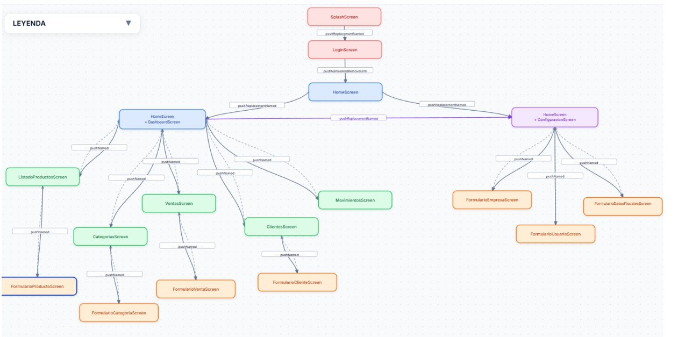
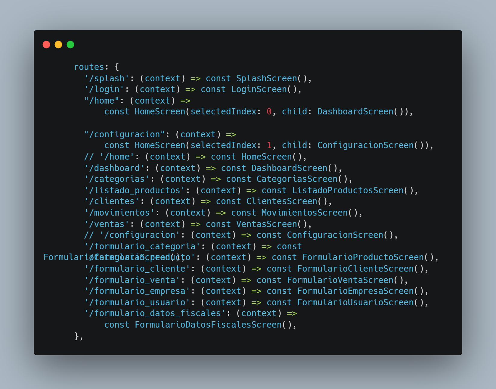
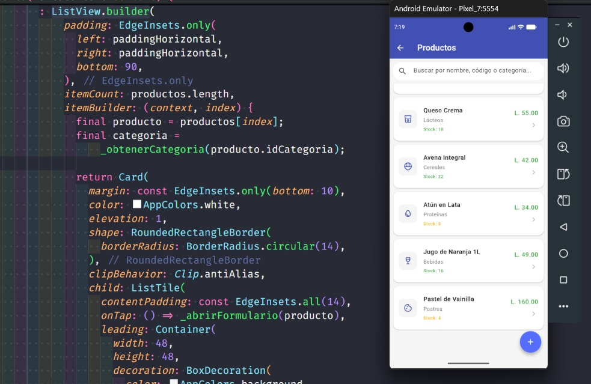
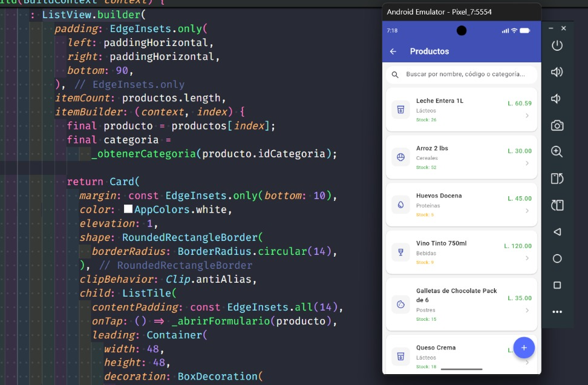
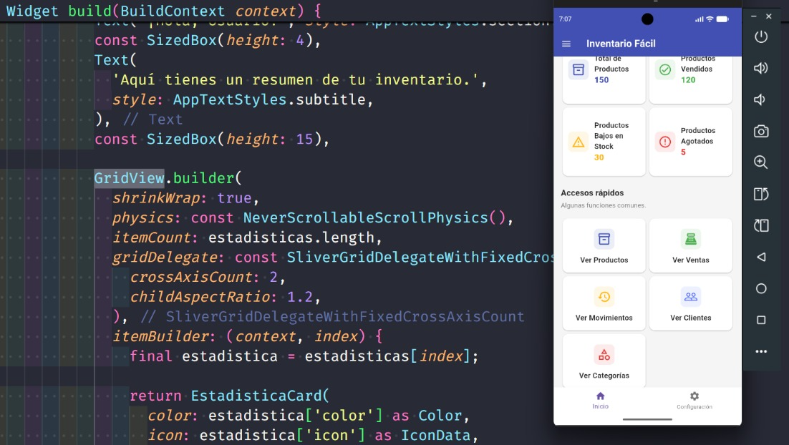
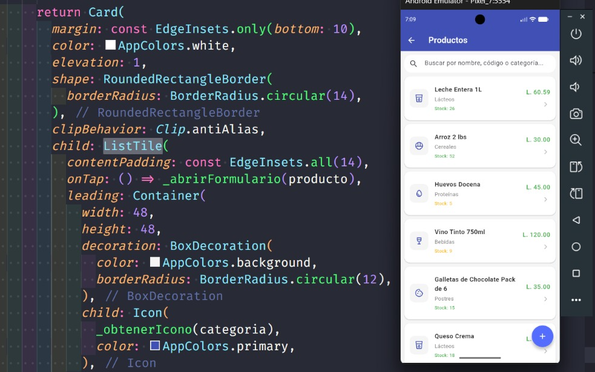
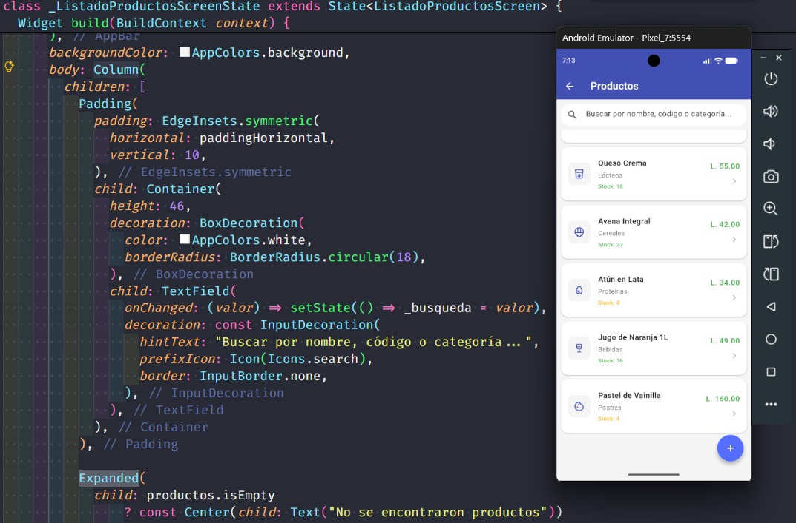
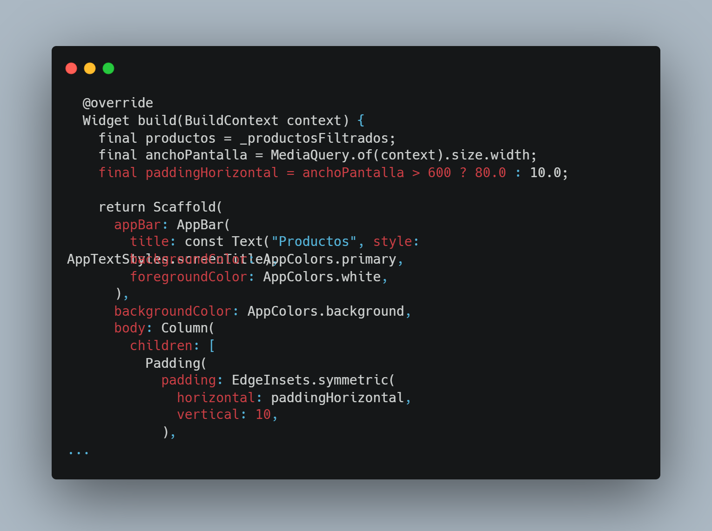
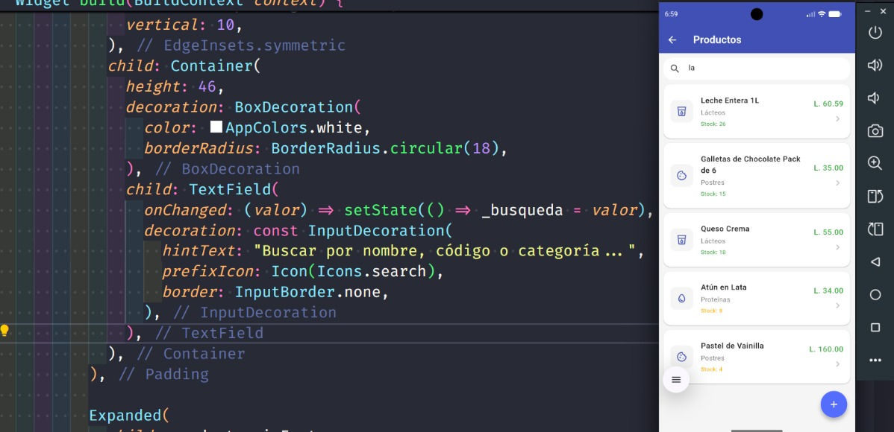

# CENTRO UNIVERSITARIO TECNOLÓGICO

  

## Programación Móvil - Sección 43

 

**Docente:** Ing. Reynaldo Cruz

 

### Actividad 4.2 Proyecto – Análisis 2

### Implementación de layouts y navegación completa del proyecto

 

**Integrantes:**

Ismael Mauricio Castillo Castro | 42511165  
 
Nidia Samantha Enamorado Taylor | 32421047

   

**La Ceiba, 14 de agosto del 2026**

---

# 1. Inventario de Pantallas

| #   | Pantalla                          | Layout Principal                                                         | Justificación                                                                                                                                                                                                                                                                              |
| --- | --------------------------------- | ------------------------------------------------------------------------ | ------------------------------------------------------------------------------------------------------------------------------------------------------------------------------------------------------------------------------------------------------------------------------------------ |
| 1   | **SplashScreen**                  | `AnimatedBuilder + FadeTransition + ScaleTransition`                     | Se utilizan para aplicar animaciones de aparición gradual y escalado al contenido de la pantalla de inicio.                                                                                                                                                                                |
| 2   | **LoginScreen**                   | `Card + Column`                                                          | Se utiliza `Card` para agrupar visualmente el formulario de inicio de sesión y `Column` para organizar sus elementos de forma vertical.                                                                                                                                                    |
| 3   | **HomeScreen**                    | `Scaffold + AppBar + Drawer + BottomNavigationBar + ListView + ListTile` | Se utiliza `Scaffold` como estructura principal, integrando un `AppBar`, un menú lateral `Drawer` y una barra de navegación inferior. El `Drawer` utiliza `ListView + ListTile` para organizar las diferentes opciones del sistema y facilitar la navegación entre módulos.                |
| 4   | **DashboardScreen**               | `SingleChildScrollView + Column + GridView.builder`                      | Se utiliza `SingleChildScrollView` para permitir el desplazamiento vertical de todo el contenido. Dentro de la pantalla se organizan las estadísticas y los accesos rápidos mediante `GridView.builder`.                                                                                   |
| 5   | **CategoriasScreen**              | `ListView + Card + FloatingActionButton`                                 | Se utiliza `ListView` para mostrar las categorías de forma vertical. Cada categoría se presenta mediante una tarjeta, mientras que el `FloatingActionButton` permite acceder al formulario para agregar una nueva categoría.                                                               |
| 6   | **ListadoProductosScreen**        | `Column + Expanded + ListView.builder`                                   | Se utiliza `Column` para organizar verticalmente los elementos de la pantalla. `Expanded` permite que la lista ocupe el espacio disponible dentro de la columna, mientras que `ListView.builder` genera dinámicamente los productos y permite desplazarse por la lista de forma eficiente. |
| 7   | **ClientesScreen**                | `ListView.builder + Card + FloatingActionButton`                         | Se utiliza `ListView.builder` para mostrar dinámicamente la lista de clientes. Cada cliente se representa mediante una tarjeta y el `FloatingActionButton` permite registrar un nuevo cliente.                                                                                             |
| 8   | **VentasScreen**                  | `Row + ElevatedButton`                                                   | Se utiliza `Row` para distribuir los datos y botones horizontalmente, mientras `ElevatedButton` permite realizar acciones relacionadas con la factura.                                                                                                                                     |
| 9   | **MovimientosScreen**             | `ListView + MovimientoCard`                                              | Se utiliza `ListView` para mostrar los movimientos de inventario de forma vertical y desplazable, mientras `MovimientoCard` organiza la información de cada movimiento.                                                                                                                    |
| 10  | **FormularioCategoriaScreen**     | `ListView + Card + Column + TextFormField`                               | Se utiliza `ListView` para permitir el desplazamiento vertical del formulario. Los campos se agrupan dentro de un `Card` y se organizan mediante `Column`.                                                                                                                                 |
| 11  | **FormularioProductoScreen**      | `DropdownButtonFormField + SwitchListTile + Row`                         | Los `DropdownButtonFormField` facilitan la selección de categoría, unidad e impuesto, mientras `Row` organiza ciertos campos horizontalmente y `SwitchListTile` controla el estado del producto.                                                                                           |
| 12  | **FormularioClienteScreen**       | `ListView + Card + Column + TextFormField`                               | Se utiliza `ListView` para permitir el desplazamiento vertical del formulario. Los campos se agrupan dentro de un `Card` y se organizan mediante `Column`.                                                                                                                                 |
| 13  | **FormularioVentaScreen**         | `Row + DropdownButtonFormField`                                          | Los `DropdownButtonFormField` facilitan la selección de clientes, productos y métodos de pago, mientras `Row` permite organizar cantidades y precios horizontalmente.                                                                                                                      |
| 14  | **ConfiguracionScreen**           | `ListView + Column + Card/ListTile`                                      | Se utiliza `ListView` para permitir el desplazamiento vertical de las diferentes secciones de configuración. Las opciones se agrupan mediante `Card` y `ListTile`.                                                                                                                         |
| 15  | **FormularioEmpresaScreen**       | `ListView + Card`                                                        | Se utiliza `ListView` para permitir el desplazamiento vertical del formulario. Los datos se organizan en diferentes `Card` según su categoría.                                                                                                                                             |
| 16  | **FormularioDatosFiscalesScreen** | `ListView + Card`                                                        | Se utiliza `ListView` para permitir el desplazamiento vertical. La información fiscal se divide en diferentes `Card`, facilitando su organización y comprensión.                                                                                                                           |
| 17  | **FormularioUsuarioScreen**       | `TextFormField + SwitchListTile`                                         | Los `TextFormField` permiten editar los datos del usuario y `SwitchListTile` permite controlar opciones como el estado del usuario o el cambio de contraseña.                                                                                                                              |

# 2. Mapa de Navegación

https://server-purr-53929180.figma.site/

# 3. Decisiones de Diseño

### 3.1. Usar `GridView.builder` para organizar las estadísticas y accesos rápidos del Dashboard

**Justificación:**  
Se eligió una distribución en cuadrícula para presentar varias opciones de manera ordenada y facilitar la visualización de la información. `GridView.builder` permite generar dinámicamente las tarjetas a partir de las listas `estadisticas` y `accesosRapidos`, evitando tener que crear cada tarjeta manualmente.

Además, `crossAxisCount: 2` permite mostrar dos elementos por fila, aprovechando mejor el espacio disponible en dispositivos móviles.

### 3.2. Separar las tarjetas de estadísticas y accesos rápidos en widgets reutilizables (`EstadisticaCard` y `AccesoRapidoCard`)

**Justificación:**  
Se decidió separar estos componentes para mantener el `DashboardScreen` organizado y facilitar la reutilización y modificación de las tarjetas.

De esta manera, la lógica de la pantalla se encarga de proporcionar los datos, mientras que cada widget se encarga de representar visualmente su contenido.

### 3.3. Organizar las opciones de configuración en grupos según su función: Cuenta, Negocio y Aplicación

**Justificación:**  
Se decidió agrupar las opciones relacionadas para facilitar la navegación y permitir que el usuario encuentre rápidamente la configuración que necesita.

Por ejemplo, los datos del usuario se encuentran en **Cuenta**, mientras que la información de la empresa y los datos fiscales se encuentran en **Negocio**. Esta organización mejora la jerarquía visual y evita presentar todas las opciones en una única lista.

### 3.4. Crear widgets reutilizables (`_SettingsGroup` y `_SettingsTile`) para construir la pantalla de configuración

**Justificación:**  
Se separó la estructura de los grupos y elementos de configuración del `ConfiguracionScreen` para evitar repetir código y facilitar el mantenimiento.

De esta forma, se pueden agregar nuevas opciones de configuración reutilizando los mismos componentes sin modificar la estructura principal de la pantalla.

# 4. Navegación por Rutas con Nombre

# 5. Layouts obligatorios

## 5.1. ListView.builder

## 5.2. GridView.builder

## 5.3 Card + ListTile

## 5.4 Column + Expanded

# 6. Responsive Básico

# 7. Filtro o Búsqueda Funcional

